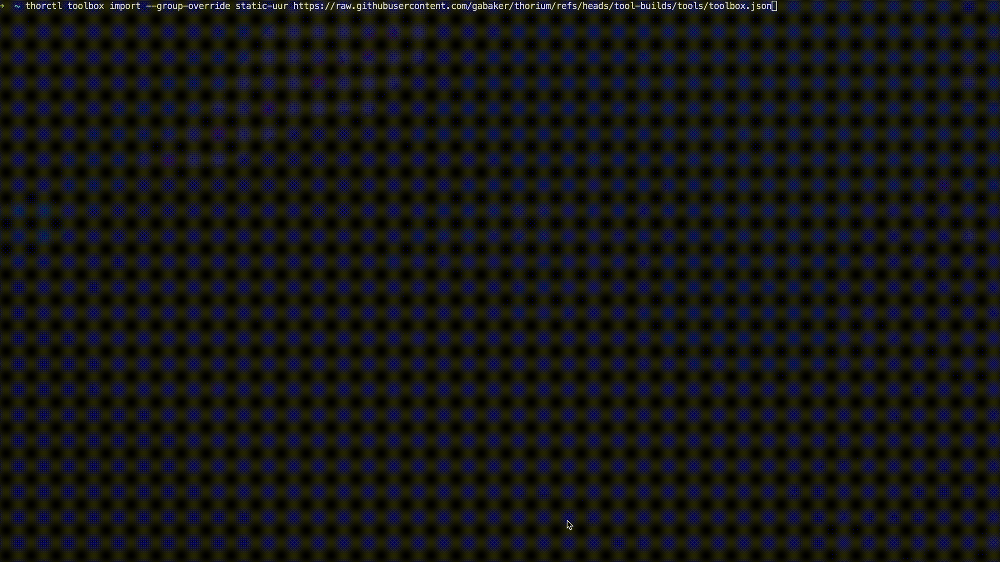

  <picture>
    <source media="(prefers-color-scheme: dark)" srcset="./api/docs/src/static_resources/logo_dark.svg">
    <source media="(prefers-color-scheme: light)" srcset="./api/docs/src/static_resources/logo_light.svg">
        
  </picture>

[Documentation] | [Install Documentation] | [Single Node Install Documentation]

A scalable file analysis and data generation platform that allows users to
easily orchestrate arbitrary docker/vm/shell tools at scale.

[Documentation]: https://cisagov.github.io/thorium/intro.html
[Install Documentation]: https://cisagov.github.io/thorium/admins/deploy/deploy.html
[Single Node Install Documentation]: https://github.com/cisagov/thorium/blob/main/minithor/README.md

### Features
---
- Highly scalable analysis of arbitrary files/repos
- Near zero-cost analysis tool integration
- Easy tool import capability
- Static and dynamic analysis sandboxes
- User friendly interfaces: GUI + CLI
- RESTful API for automated access to data
- Multi-tenant friendly permission system
- Full-text search of analysis results
- Key/Value tags for labeling data

### FAQ
---

##### What Does Thorium actually do?

Thorium allows for developers or analysts to:
 - Easily scale up and orchestrate docker or baremetal based tools
 - Easily search and use results from tools
 - Comment and share files, tags, and results between users/analysts

##### Are any tools included?

Yes, you can use thorctl toolbox to import over 40 images and 20 pipelines into
your Thorium instance. Some examples of images you can import are:
 - binwalk
 - capa
 - clamav
 - cwe-checker
 - email-parser
 - floss
 - foremost
 - ssdeep
 - quantumstrand
 - xortool
 - zeek-dump

##### What do I need to deploy Thorium?

Thorium was built and intended to run in a K8s cluster but it can also run on a
laptop using minikube. However it is important to note the single node deployment
was not intended for production and reliability/stability may be less then stellar.
To deploy a single node instance follow the Minithor docs
[here](https://github.com/cisagov/thorium/blob/main/minithor/README.md).

For full production deployment on a cluster you will need the following:
- Block store provider
- S3 storage

For on prem deployments we recommend CEPH. To deploy Thorium on a cluster
follow the docs [here](https://cisagov.github.io/thorium/admins/deploy/deploy.html).

##### How scalable is Thorium?

Thorium is almost infinitely scalable if you have the compute/storage. Thorium has
been tested to support billions of samples and utilization of large amounts of
compute. Thorium partitions data temporally and allows admins to
configure how scalable they want the system to be.

##### Does Thorium call home or send any telemetry out?

No, Thorium does not send any telemetry out.

##### How large of files/repos does Thorium support?

Currently, Thorium supports up to ~50 GiB per file/repo. This is after
compression and so it is a fuzzy limit but it should never be significantly
smaller then 50 GiB. We do have plans to increase this limit in the future
please create an issue if you feel this would be useful.

##### Can you add more documentation and examples of using Thorium and what it can do?

Yes, we plan to continue to expand our documentation and examples soon.

### Funded by
---

  <picture>
    <source media="(prefers-color-scheme: dark)" srcset="./api/docs/src/static_resources/funders_dark.png">
    <source media="(prefers-color-scheme: light)" srcset="./api/docs/src/static_resources/funders.png">
        

Contact us at thorium@sandia.gov.
